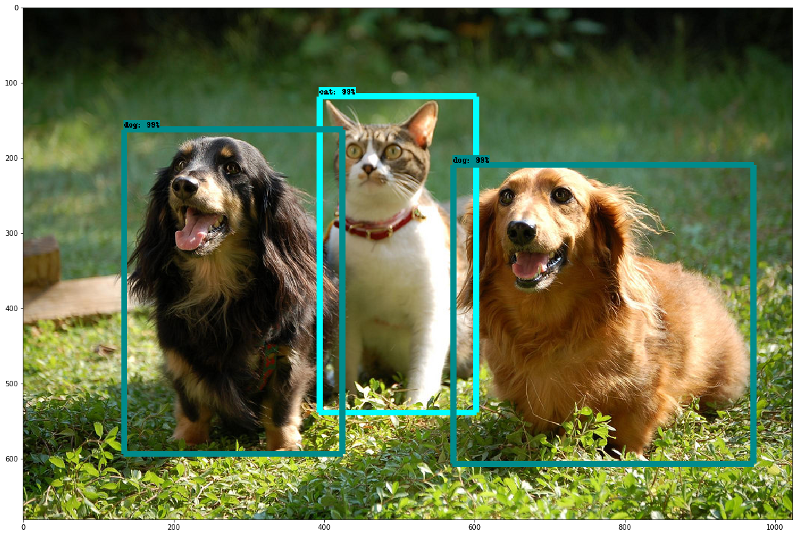

============
Descripción
============

¿Qué es Tensorflow?.

Una biblioteca open-source para Machine Intelligence.

.. image:: img/TF01.png

TensorFlow tiene APIs disponibles en varios lenguajes de programación para utilizarlas en nuestras aplicaciones. La API de Python está en  el lenguaje más completo y fácil de usar, pero en otros idiomas las API pueden ser más fáciles de integrar en los proyectos y pueden ofrecer algunos ventajas de rendimiento en la ejecución de gráficos, por ejemplo.

 `Python  <https://www.tensorflow.org/api_docs/python/>`_, 
 `C++  <https://www.tensorflow.org/api_docs/cc/>`_, 
 `Java  <https://www.tensorflow.org/api_docs/java/reference/org/tensorflow/package-summary>`_, 
 `Go  <https://godoc.org/github.com/tensorflow/tensorflow/tensorflow/go>`_.

 La `API Layers  <https://www.tensorflow.org/tutorials/layers/>`_ proporciona una interfaz más simple para capas utilizadas comúnmente en modelos de deep learning. Además de eso, se encuentran API de nivel superior, que incluyen `Keras  <https://www.tensorflow.org/versions/master/api_docs/python/tf/contrib/keras>`_ y la `API Estimator  <https://www.tensorflow.org/get_started/estimator>`_ que facilita el entrenamiento y la evaluación de modelos distribuidos.

 .. image:: img/TF02.png

TensorFlow y la comunidad de software de código abierto.

TensorFlow fue de origen abierto en gran parte para permitir a la comunidad mejorarlo con contribuciones. Cualquier duda o consulta podemos ir a los siguientes enlaces `Stack Overflow  <https://stackoverflow.com/questions/tagged/tensorflow>`_ y `mail  <https://groups.google.com/a/tensorflow.org/forum/#!forum/discuss>`_.

Modelos de fuente abierta de TensorFlow
El equipo de TensorFlow ha abierto una gran cantidad de modelos. Puede encontrarlos en el `repositorio tensorflow / models  <https://github.com/tensorflow/models>`_. Para muchos de estos, el código publicado incluye no solo el gráfico del modelo, sino también los pesos del modelo entrenado. Esto significa que puede probar estos modelos al instante, y puede utilizar muchos más con un proceso llamado `aprendizaje de transferencia <https://www.tensorflow.org/tutorials/image_retraining>`_.

Estos son solo algunos de los modelos lanzados.

La `API de Detección de Objetos <http://research.googleblog.com/2017/06/supercharge-your-computer-vision-models.html>`_: Sigue siendo un desafío central de aprendizaje automático crear modelos precisos de aprendizaje automático capaces de localizar e identificar múltiples objetos en una sola imagen. La `API de Detección de Objetos TensorFlow <https://github.com/tensorflow/models/tree/master/research/object_detection>`_ de fuente abierta recientemente ha producido resultados de vanguardia (y se ha colocado primero en el desafío de detección de `COCO <http://mscoco.org/dataset/#detections-leaderboard>`_).

