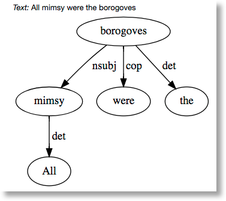
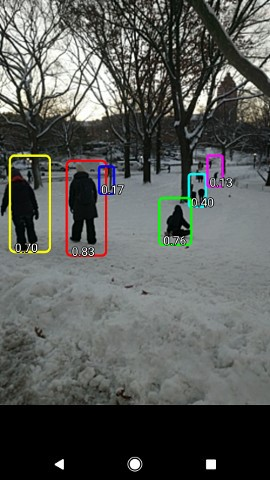

=======================================
Modelos de código abierto de TensorFlow
=======================================

Modelos de código abierto de TensorFlow

El equipo de TensorFlow ha abierto una gran cantidad de modelos. Puede encontrarlos en el `repositorio tensorflow / models  <https://github.com/tensorflow/models>`_. Para muchos de estos, el código publicado incluye no solo el gráfico del modelo, sino también los pesos del modelo entrenado. Esto significa que puede probar estos modelos al instante, y puede utilizar muchos más con un proceso llamado `aprendizaje de transferencia <https://www.tensorflow.org/tutorials/image_retraining>`_.

Estos son solo algunos de los modelos lanzados:

La `API de Detección de Objetos <http://research.googleblog.com/2017/06/supercharge-your-computer-vision-models.html>`_: Sigue siendo un desafío central de aprendizaje automático crear modelos precisos de aprendizaje automático capaces de localizar e identificar múltiples objetos en una sola imagen. La `API de Detección de Objetos TensorFlow <https://github.com/tensorflow/models/tree/master/research/object_detection>`_ de fuente abierta recientemente ha producido resultados de vanguardia (y se ha colocado primero en el desafío de detección de `COCO <http://mscoco.org/dataset/#detections-leaderboard>`_).

.. image:: img/TF03.png

`tf-seq2seq <https://google.github.io/seq2seq/getting_started/>`_: Google anunció previamente
`Google Neural Machine Translation (GNMT) <https://research.googleblog.com/2016/09/a-neural-network-for-machine.html>`_, un modelo de secuencia a secuencia (seq2seq) que ahora se utiliza en los sistemas de producción Google Translate. tf-seq2seq es un marco de código abierto seq2seq en TensorFlow que hace que sea fácil experimentar con modelos seq2seq y lograr resultados de última generación.

`ParseySaurus <https://research.googleblog.com/2017/03/an-upgrade-to-syntaxnet-new-models-and.html>`_ es un conjunto de modelos prediseñados que reflejan una actualización a `SyntaxNet <https://research.googleblog.com/2017/03/an-upgrade-to-syntaxnet-new-models-and.html>`_. Los nuevos modelos usan una representación de entrada basada en caracteres y son mucho mejores para predecir el significado de palabras nuevas basadas tanto en su ortografía como en cómo se usan en el contexto. Son mucho más precisos que sus predecesores, particularmente para los idiomas en los que puede haber docenas de formas para cada palabra y muchas de estas formas podrían nunca ser observadas durante el entrenamiento, incluso en un corpus muy grande.

`Multistyle Pastiche Generator <https://magenta.tensorflow.org/2016/11/01/multistyle-pastiche-generator/>`_ del `Proyecto Magenta <https://magenta.tensorflow.org/>`_ : "Transferencia de estilo" es lo que sucede bajo aplicaciones que utilizan el estilo de una pintura a una foto. Este modelo Magenta amplía la transferencia de estilo de imagen al `crear una red única <https://github.com/tensorflow/magenta/tree/master/magenta/models/image_stylization>`_ crear una red única que puede realizar más de una estilización de una imagen.

Uso de TensorFlow en dispositivos móviles

TensorFlow está trabajando para ayudar a los desarrolladores a crear `aplicaciones móviles ligeras <https://github.com/tensorflow/tensorflow/tree/master/tensorflow/examples/android/>`_, tanto al continuar reduciendo la huella del código como al respaldar la cuantificación de este.
Uno de los proyectos de TensorFlow, `MobileNet <https://research.googleblog.com/2017/06/mobilenets-open-source-models-for.html>`_ , está desarrollando un conjunto de modelos de visión por computador especialmente diseñados para abordar las ventajas y desventajas de velocidad / precisión que deben considerarse en los dispositivos móviles o en las aplicaciones integradas. Los modelos de MobileNet se pueden encontrar en el `repositorio de modelos TensorFlow <https://github.com/tensorflow/models/blob/master/research/slim/nets/mobilenet_v1.md>`_ también.

Una de las demostraciones más recientes de Android, `TF Detect <https://github.com/tensorflow/tensorflow/blob/master/tensorflow/examples/android/src/org/tensorflow/demo/DetectorActivity.java>`_, usa un modelo de MobileNet entrenado usando la API de detección de objetos Tensorflow.

