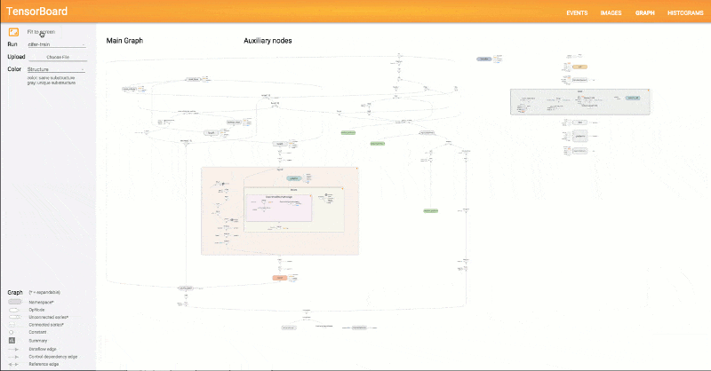
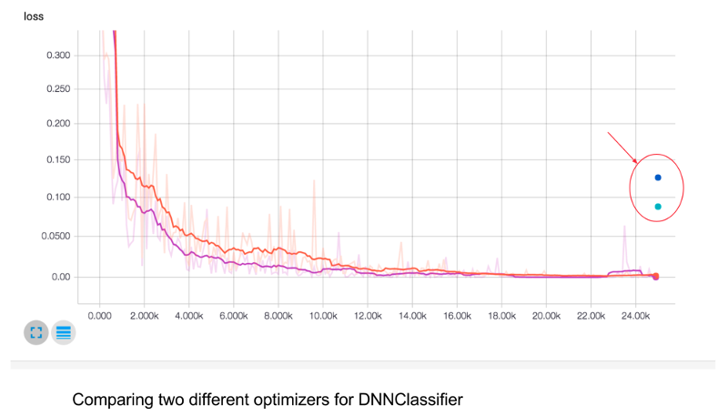
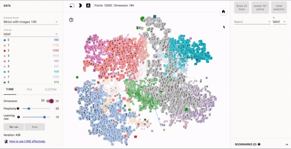

========================
El ecosistema TensorFlow
========================

El ecosistema TensorFlow incluye muchas herramientas y bibliotecas, mencionaremos las principales:

`TensorBoard <https://github.com/tensorflow/tensorboard/blob/master/README.md>`_: es un conjunto de aplicaciones web para inspeccionar, visualizar y comprender las ejecuciones y gráficos de TensorFlow. Podemos usar TensorBoard para ver los gráficos del modelo TensorFlow y acercar los detalles de las subsecciones.

Puede trazar métricas como la pérdida y la precisión durante una ejecución de entrenamiento; mostrar las visualizaciones del histograma de cómo un tensor está cambiando con el tiempo; mostrar datos adicionales, como imágenes; recopilar metadatos de tiempo de ejecución para una ejecución, como el uso total de la memoria y las formas del tensor para los nodos.

TensorBoard funciona leyendo los archivos de TensorFlow que contienen `información resumida <https://www.tensorflow.org/get_started/summaries_and_tensorboard>`_ sobre el proceso de capacitación. Puede generar estos archivos cuando ejecuta trabajos de TensorFlow.

Puede usar TensorBoard para comparar ejecuciones de entrenamiento, recopilar estadísticas de tiempo de ejecución y generar `histogramas <https://www.tensorflow.org/get_started/tensorboard_histograms>`_.

Una característica particularmente fascinante de TensorBoard es su `visualizador de incrustaciones <https://www.tensorflow.org/get_started/embedding_viz>`_. Las `incrustaciones <http://colah.github.io/posts/2014-10-Visualizing-MNIST/>`_ son `omnipresentes <https://www.tensorflow.org/tutorials/word2vec>`_ en el aprendizaje automático, y en el contexto de TensorFlow, a menudo es natural ver los tensores como puntos en el espacio, por lo que casi cualquier modelo de TensorFlow dará lugar a varias incrustaciones.

Datalab: `Jupyter <https://jupyter.org/>`_ notebooks es una manera fácil de explorar interactivamente los datos, definir modelos TensorFlow e iniciar entrenamientos. Utilizando herramientas y productos de Google Cloud Platform como parte del flujo de trabajo, tal vez usando `Google Cloud Storage <https://cloud.google.com/storage/>`_ o `BigQuery <https://cloud.google.com/bigquery/>`_ para conjuntos de datos, o `Apache <https://beam.apache.org/>`_ Beam para `preprocesamiento de datos <https://github.com/GoogleCloudPlatform/cloudml-samples/blob/master/flowers/pipeline.py#L201>`_, entonces `Google Cloud Datalab <https://cloud.google.com/datalab/>`_ proporciona un entorno basado en Jupyter con todas estas herramientas (y otros como NumPy, pandas, scikit-learn y Matplotlib), junto con TensorFlow, preinstalados y agrupados. `Datalab <https://github.com/googledatalab/datalab>`_ es de código abierto.

Facets: El poder del aprendizaje de máquinas proviene de su capacidad de aprender patrones a partir de grandes cantidades de datos, por lo que comprender sus datos puede ser fundamental para construir un poderoso sistema de aprendizaje automático. `Facets <https://research.googleblog.com/2017/07/facets-open-source-visualization-tool.html>`_ es una `herramienta de visualización de datos de código abierto <https://pair-code.github.io/facets/>`_ recientemente lanzada que ayuda a comprender sus conjuntos de datos de aprendizaje automático y obtener una idea de la forma y características de cada característica y ver de un vistazo cómo interactúan las características entre sí. Por ejemplo, puede ver sus conjuntos de datos de entrenamiento y prueba.

Otra herramienta de diagnóstico útil es el `depurador TensorFlow <https://www.tensorflow.org/programmers_guide/debugger>`_ , tfdbg , que permite ver la estructura interna y los estados de ejecución de los gráficos TensorFlow durante el entrenamiento y la inferencia.

Hay muchas otras herramientas y bibliotecas `repositorios org de TensorFlow GitHub para conocerlos <https://github.com/tensorflow>`_.