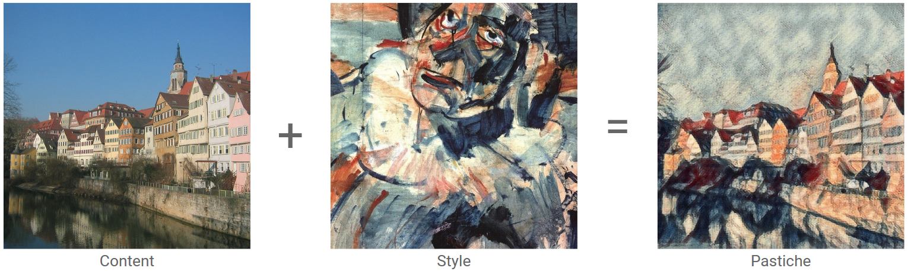
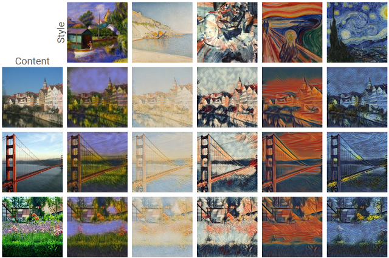
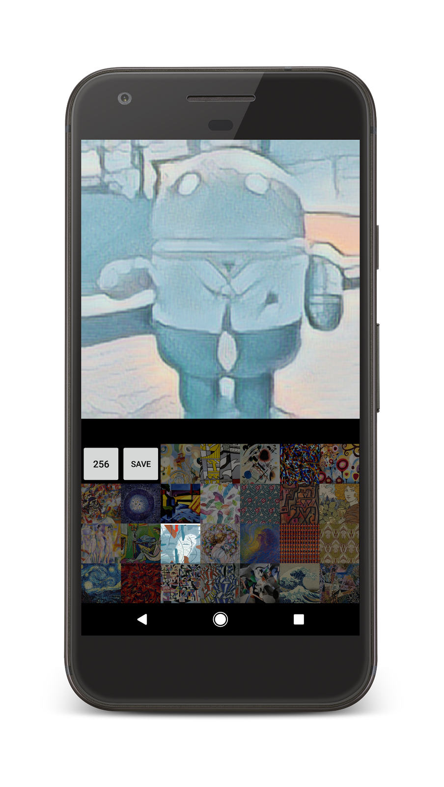
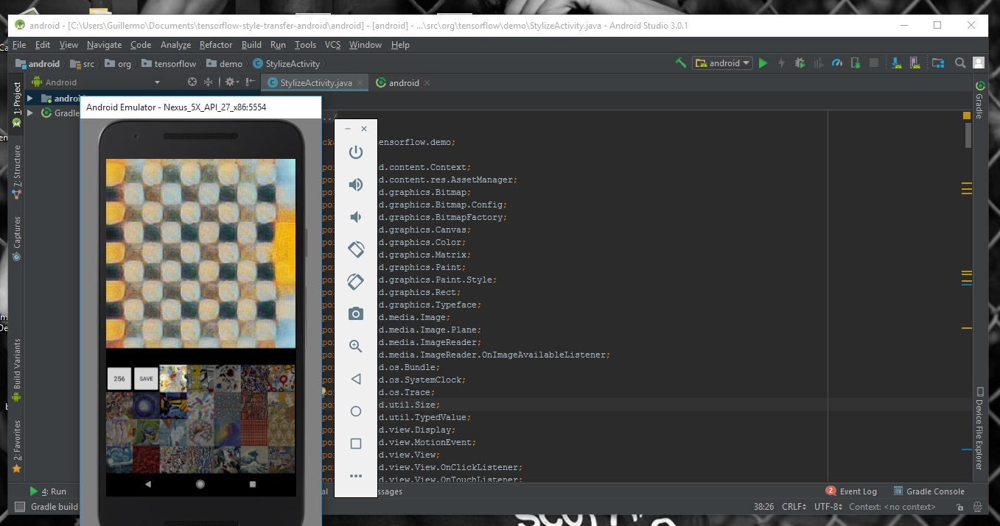

====================================
Transferencia de estilo artístico
====================================

Uno de los desarrollos más interesantes en el aprendizaje profundo que ha surgido recientemente es la transferencia de estilo artístico , o la capacidad de crear una nueva imagen, conocida como pastiche , basada en dos imágenes de entrada: una que representa el estilo artístico y otra que representa el contenido.

Usando esta técnica, podemos generar bellas obras de arte nuevas en una variedad de estilos.

Utilizaremos una red neuronal de transferencia de estilo artístico en una aplicación de Android en solo 9 líneas de código . Usar las técnicas descritas en este código para implementar cualquier red TensorFlow.

Usaremos:

Uso de las bibliotecas Java y nativas Android de TensorFlow en su aplicación.

Importación de un modelo capacitado de TensorFlow en una aplicación de Android.

Realizar inferencia en una aplicación de Android.

Accediendo a tensores específicos en un gráfico de TensorFlow.

Necesitamos:

Un dispositivo Android que ejecuta Lollipop (API 21, v5.0) con una cámara compatible con `Camera2 API <https://developer.android.com/reference/android/hardware/camera2/package-summary.html>`_ (introducido en API 21)

Android Studio v2.2 o superior

Incluyendo v23 (Marshmallow) o superior de las herramientas de compilación SDK

Obtener el código:

Hay dos formas de obtener la fuente de este codelab: descargue un archivo ZIP que contenga el código o clónelo desde GitHub.

`Descargar ZIP <https://github.com/googlecodelabs/tensorflow-style-transfer-android/archive/codelab-start.zip>`_

Verifique el código de GitHub:

	git clone https://github.com/googlecodelabs/tensorflow-style-transfer-android

Abra Android Studio y seleccione Importar proyecto. 
En el cuadro de diálogo de archivo, deberá navegar hasta "android" directorio dentro del directorio que descargó en el paso anterior. Por ejemplo, si revisó el código en su directorio personal, $HOME/tensorflow-style-transfer-android/android.

Si se le solicita, debe aceptar la sugerencia de usar el Gradle wrapper y rechazar usar Instant Run.

Importante:

	Es necesario importar / abrir el directorio android, no tensorflow-style-transfer-android directory

Una vez que Android Studio haya importado el proyecto, use el buscador de archivos para abrir la clase StylizeActivity. Aquí es donde trabajaremos: si puede cargar el archivo, OK, pasemos a la siguiente sección.

Cargue el esqueleto de la aplicación de Android

El esqueleto de esta aplicación contiene una aplicación de Android que toma fotogramas de la cámara del dispositivo y los muestra en una vista de la actividad principal.

Controles de interfaz de usuario:

El primer botón, etiquetado con un número ( 256 de forma predeterminada) controla el tamaño de la imagen para mostrar (y finalmente se ejecuta a través de la red de transferencia de estilo). Los números más pequeños significan imágenes más pequeñas, que serán más rápidas de transformar, pero de menor calidad. Por el contrario, las imágenes más grandes contendrán más detalles, pero tomarán más tiempo en transformarse.

El segundo botón, etiquetado save, guardará el marco actual en su dispositivo para que lo use más adelante.

Las miniaturas representan los estilos posibles que puede usar para transformar la alimentación de la cámara. Cada imagen es un control deslizante y puede combinar varios controles deslizantes que representarán las proporciones de cada estilo que desee aplicar a los marcos de la cámara. Estas relaciones, junto con el marco de la cámara, representan las entradas en la red.

El código de la aplicación incluye algunos helpers que se requieren para la interfaz entre TensorFlow nativo y Android Java. Los detalles de su implementación no son importantes, pero debe comprender lo que hacen.

	StylizeActivity.onPreviewSizeChosen(...)

El esqueleto de la aplicación utiliza un fragmento de cámara personalizado que llamará a este método una vez que se hayan otorgado los permisos y la cámara esté disponible para su uso.

	StylizeActivity.setStyle(...)

Esto mantiene los controles deslizantes de estilo normalizados de modo que sus valores se suman a 1.0, en línea con lo que nuestra red espera.

	StylizeActivity.renderDebug(...)

Proporciona una superposición de depuración al presionar los botones para subir o bajar el volumen en el dispositivo, incluida la salida de TensorFlow, las métricas de rendimiento y la imagen original sin estilo.

	StylizeActivity.stylizeImage(...)

Aquí es donde haremos nuestro trabajo. El código provisto realiza alguna conversión entre matrices de enteros (proporcionadas por getPixels() método de Android ) del formulario [0xRRGGBB, ...] a arreglos floats [0.0, 1.0] del formulario [r, g, b, r, g, b, ...].

	ImageUtils.*

Proporciona algunos helpers para transformar imágenes. La cámara proporciona datos de imagen en `YUV space <https://en.wikipedia.org/wiki/YUV>`_ (ya que es el más ampliamente compatible), pero la red espera `RGB <https://en.wikipedia.org/wiki/RGB_color_space>`_ , por lo que ofrecemos helpers para convertir la imagen. La mayoría de estos se implementan en C ++ nativo para la velocidad; el código está en el `jni <https://github.com/tensorflow/tensorflow/tree/master/tensorflow/examples/android/jni>`_ directorio, pero para este laboratorio se proporciona a través de los libtensorflow_demo.so binarios preconstruidos en el libsdirectorio (definido como jniLibs en Android Studio). Si no están disponibles, el código recurrirá a una implementación de Java.

Acerca de esta red

	Si bien no es crítico entender cómo funciona esta red para usarla o importarla, aquí se proporcionan algunos antecedentes. SE PUEDE SALTAR ESTA SECCIÓN

	La red que estamos importando es el resultado de varios desarrollos importantes. El primer papel de transferencia de estilo neuronal `( Gatys, et al., 2015 ) <http://arxiv.org/abs/1508.06576>`_ introdujo una técnica que explota las propiedades de las redes de clasificación de imágenes convolucionales, donde las capas inferiores identifican bordes y formas simples (componentes de estilo) y los niveles superiores identifican contenido más complejo para generar un "pastiche" Esta técnica funciona en dos imágenes, pero es lenta en su ejecución.

	Desde entonces, se han propuesto varias mejoras, incluida una que compensa las redes de preentrenamiento para cada estilo `( Johnson, et al., 2016 ) <https://arxiv.org/abs/1603.08155>`_ , lo que genera generación de imágenes en tiempo real.

	Finalmente, la red que utilizamos en este laboratorio `( Dumoulin, et al., 2016 ) <https://arxiv.org/abs/1610.07629>`_  intuyó que diferentes redes que representan diferentes estilos probablemente estarían duplicando mucha información, y propuso una red única entrenada en múltiples estilos. Un efecto secundario interesante de esto fue la capacidad de combinar estilos, que estamos usando aquí.

	Para una comparación dela técnica de estas redes, así como la revisión de otras, consulte el artículo de revisión de `Cinjon Resnick <https://github.com/tensorflow/magenta/blob/master/magenta/reviews/styletransfer.md>`_ .

	Dentro de la red
	El código original de TensorFlow que generó esta red está disponible en la página `GitHub de Magenta <https://github.com/tensorflow/magenta>`_, específicamente el `modelo de transformación de imágenes estilizadas <https://github.com/tensorflow/magenta/blob/master/magenta/models/image_stylization/model.py#L28>`_ ( `README <https://github.com/tensorflow/magenta/blob/master/magenta/models/image_stylization/README.md>`_ ).

	Antes de usarlo en un entorno con recursos limitados, como una aplicación móvil, este modelo se exportó y transformó para usar tipos de datos más pequeños y eliminar cálculos redundantes. Puede leer más sobre este proceso en el documento `Graph Transforms <https://github.com/tensorflow/tensorflow/blob/master/tensorflow/tools/graph_transforms/README.md>`_.

	El resultado final es el stylize_quantized.pb archivo, que se muestra a continuación, que usará en la aplicación. El nodo transformador contiene la mayor parte del gráfico, haga clic en la `versión interactiva para expandirlo <https://googlecodelabs.github.io/tensorflow-style-transfer-android/>`_.

Agregar dependencias al proyecto:

Para agregar las bibliotecas de inferencia y sus dependencias a nuestro proyecto, debemos agregar la biblioteca de inferencia de Android TensorFlow y la API de Java, que está disponible en `JCenter <https://bintray.com/google/tensorflow/tensorflow>`_ (en Archivos, tensorflow-android) o puede compilarlo desde la fuente `TensorFlow <https://github.com/tensorflow/tensorflow/tree/master/tensorflow/contrib/android>`_.

	1.Abrir  build.gradle en Android Studio.
	2.Agregue la API al proyecto agregándola a "dependencies block" dentro del android block (nota: este no es el buildscript block).

`build.gradle <https://github.com/googlecodelabs/tensorflow-style-transfer-android/blob/codelab-finish/android/build.gradle>`_ 

::

	dependencies {
	compile 'org.tensorflow:tensorflow-android:1.2.0-preview'
	}

	3.Haga clic en el botón de Gradle sync para que estos cambios estén disponibles en el IDE.

La interfaz de inferencia de TensorFlow

Al ejecutar el código de TensorFlow, normalmente necesitaría administrar tanto un gráfico computacional como una sesión (como se describe en los documentos de `Getting Started <https://www.tensorflow.org/get_started/get_started#the_computational_graph>`_ ); sin embargo, dado que los desarrolladores de Android probablemente deseen realizar inferencias sobre un gráfico preconstruido, TensorFlow proporciona una interfaz Java que maneja la gráfica y la sesión: `TensorFlowInferenceInterface <https://github.com/tensorflow/tensorflow/blob/master/tensorflow/contrib/android/java/org/tensorflow/contrib/android/TensorFlowInferenceInterface.java>`_.

Si necesita más control, la API de TensorFlow Java proporciona `Session <https://github.com/tensorflow/tensorflow/blob/master/tensorflow/java/src/main/java/org/tensorflow/Session.java>`_ y los `Graph <https://github.com/tensorflow/tensorflow/blob/master/tensorflow/java/src/main/java/org/tensorflow/Graph.java>`_ objetos que puede conocer de la API de Python.

La red de transferencia de estilo

Hemos incluido la red de transferencia de estilo descrita en la última sección del  assets, directorio del proyecto , por lo que estará disponible para el uso. También puede `descargarlo directamente <https://storage.googleapis.com/download.tensorflow.org/models/stylize_v1.zip>`_ o compilarlo `desde el proyecto Magenta <https://github.com/tensorflow/magenta/blob/master/magenta/models/image_stylization/README.md>`_ .

Puede valer la pena abrir el visor gráfico interactivo para que pueda ver los nodos a los que haremos referencia en breve ( Sugerencia : abra el nodo transformado haciendo clic en el ícono + que aparece una vez que se desplaza).

`Grafico interactivo <https://googlecodelabs.github.io/tensorflow-style-transfer-android/>`_

Agregue el código de inferencia

	En StylizeActivity.java, agregue los siguientes campos, cerca de la parte superior de la clase (por ejemplo, justo antes de la NUM_STYLES)

`StylizeActivity.java <https://github.com/googlecodelabs/tensorflow-style-transfer-android/blob/codelab-finish/android/src/org/tensorflow/demo/StylizeActivity.java>`_ 

::
	
	// Copy these lines below
	private TensorFlowInferenceInterface inferenceInterface;

	private static final String MODEL_FILE = "file:///android_asset/stylize_quantized.pb";

	private static final String INPUT_NODE = "input";
	private static final String STYLE_NODE = "style_num";
	private static final String OUTPUT_NODE = "transformer/expand/conv3/conv/Sigmoid";

	// Do not copy this line, you want to find it and paste before it.
	private static final int NUM_STYLES = 26;

cada uno de estos nodos corresponde a un nodo del mismo nombre en el gráfico. Intente encontrarlos en la herramienta gráfica interactiva anterior. Donde vea un / (carácter de barra) tendrá que expandir un nodo para ver sus elementos secundarios.

	En la misma clase, encuentre el método onPreviewSizeChosen y construya el TensorFlowInferenceInterface. Utilizamos este método para la inicialización, ya que se llama una vez que se otorgan los permisos al sistema de archivos y a la cámara.

::

	@Override
	public void onPreviewSizeChosen(final Size size, final int rotation) {
	 // anywhere in here is fine

	 inferenceInterface = new TensorFlowInferenceInterface(getAssets(), MODEL_FILE);

	 // anywhere at all...
	}

Importante : si recibe una advertencia sobre " No se puede encontrar el símbolo ... ", deberá agregar las declaraciones de importación en este archivo. Android Studio puede hacer esto para usted si se mueve el cursor sobre el texto de error en rojo, pulse Alt-Intro , y selecciona Importar ...

	Ahora encuentre el método stylizeImage, agregue el código para pasar nuestro mapa de bits de la cámara y los estilos elegidos a TensorFlow y tome la salida del gráfico. Esto va entre los dos bucles.

`StylizeActivity.java <https://github.com/googlecodelabs/tensorflow-style-transfer-android/blob/codelab-finish/android/src/org/tensorflow/demo/StylizeActivity.java>`_ 

::

	private void stylizeImage(final Bitmap bitmap) {
	 // Find the code marked with: TODO: Process the image in TensorFlow here.
	 // Then paste the following code in at that location.
	 
	 // Start copying here:

	 // Copy the input data into TensorFlow.
	 inferenceInterface.feed(INPUT_NODE, floatValues, 
	   1, bitmap.getWidth(), bitmap.getHeight(), 3);
	 inferenceInterface.feed(STYLE_NODE, styleVals, NUM_STYLES);

	 // Execute the output node's dependency sub-graph.
	 inferenceInterface.run(new String[] {OUTPUT_NODE}, isDebug());

	 // Copy the data from TensorFlow back into our array.
	 inferenceInterface.fetch(OUTPUT_NODE, floatValues);

	 // Don't copy this code, it's already in there.
	 for (int i = 0; i < intValues.length; ++i) {
	 // ...
	}

	Opcional: busque renderDebugy agregue el texto de estado de TensorFlow a la superposición de depuración (que se activa cuando presiona las teclas de volumen).			

`StylizeActivity.java <https://github.com/googlecodelabs/tensorflow-style-transfer-android/blob/codelab-finish/android/src/org/tensorflow/demo/StylizeActivity.java>`_ 

::

	private void renderDebug(final Canvas canvas) {
	 // ... provided code that does some drawing ...

	 // Look for this line, but don't copy it, it's already there.
	 final Vector<String> lines = new Vector<>();

	 // Add these three lines right here:
	 final String[] statLines = inferenceInterface.getStatString().split("\n");
	 Collections.addAll(lines, statLines);
	 lines.add("");

	 // Don't add this line, it's already there
	 lines.add("Frame: " + previewWidth + "x" + previewHeight);
	 // ... more provided code for rendering the text ...
	}

Importante : si recibe una advertencia sobre " No se puede encontrar el símbolo ... ", deberá agregar las declaraciones de importación en este archivo. Android Studio puede hacer esto para usted si se mueve el cursor sobre el texto de error en rojo, pulse Alt-Intro , y selecciona Importar ... .

Finalmente

	En Android Studio, presione el botón Ejecutar y espere a que se construya el proyecto.

	¡Ahora debería ver la transferencia de estilos en su dispositivo!

