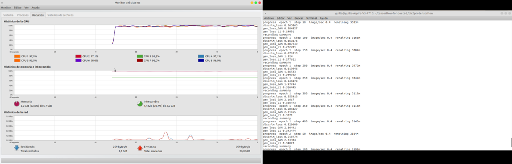

====================================
¿Transferencia de estilo artístico
====================================

Uno de los desarrollos más interesantes en el aprendizaje profundo que ha surgido recientemente es la transferencia de estilo artístico , o la capacidad de crear una nueva imagen, conocida como pastiche , basada en dos imágenes de entrada: una que representa el estilo artístico y otra que representa el contenido.

El modelo pix2pix funciona entrenando en pares de imágenes, como la construcción de etiquetas de fachada para construir fachadas, y luego intenta generar la imagen de salida correspondiente desde cualquier imagen de entrada que le proporcione. La idea es directamente del papel pix2pix , que es una buena lectura.

.. image:: img/TF14.jpg

Requisitos previos:

Tensorflow 1.0.0

Recomendado:

Linux con Tensorflow GPU edition + cuDNN

`Instalación tensorflow <https://www.tensorflow.org/install/>`_.

`cuDNN para mayor performance <https://developer.nvidia.com/cudnn>`_.

Empezando::

	# clonar este repositorio
	git clone https://github.com/affinelayer/pix2pix-tensorflow.git
	cd pix2pix-tensorflow
	 # descarga el conjunto de datos de fachadas CMP (generado a partir de http://cmp.felk.cvut.cz/~tylecr1/facade/)
	python tools/download-dataset.py facades

	# entrenar el modelo (esto puede demorar 1-8 horas dependiendo de la GPU, en la CPU estará esperando un poco)

	python pix2pix.py \
	  --mode train \
	  --output_dir facades_train \
	  --max_epochs 200 \
	  --input_dir facades/train \
	  --which_direction BtoA

	# prueba el modelo

	python pix2pix.py \
	  --mode test \
	  --output_dir facades_test \
	  --input_dir facades/val \
	  --checkpoint facades_train

La ejecución de prueba generará un archivo HTML en el facades_test/index.html que se muestran los conjuntos de imágenes de entrada / salida / destino.

Si tiene instalado Docker, puede usar la imagen proporcionada de Docker para ejecutar pix2pix sin instalar la versión correcta de Tensorflow::

	# entrenar el modelo
	python tools/dockrun.py python pix2pix.py \
	      --mode train \
	      --output_dir facades_train \
	      --max_epochs 200 \
	      --input_dir facades/train \
	      --which_direction BtoA
	# prueba el modelo
	python tools/dockrun.py python pix2pix.py \
	      --mode test \
	      --output_dir facades_test \
	      --input_dir facades/val \
	      --checkpoint facades_train

`Más Información <https://github.com/affinelayer/pix2pix-tensorflow>`_. 