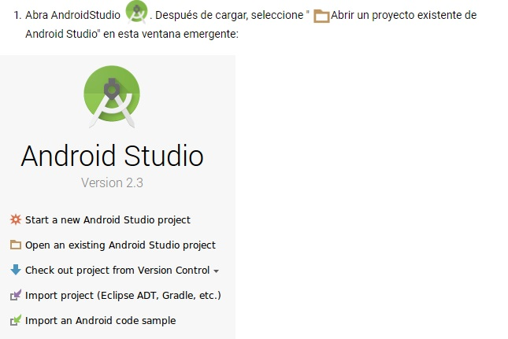

=====================================
Reconocimiento de imágenes TensorFlow
=====================================

Conoceremos:

Cómo entrenar un modelo de reconocimiento de imágenes personalizado.

Cómo optimizar tu modelo

Cómo comprimir tu modelo

Cómo ejecutarlo en una aplicación de Android prefabricada.

.. image:: img/tf21.png

Haremos:

Una aplicación de cámara simple que ejecuta un programa de reconocimiento de imágenes TensorFlow para identificar flores.

Preparar:

La mayoría de este tutorial usará el terminal. 

Instalar TensorFlow

Antes de que podamos comenzar con el tutorial, debes `instalar tensorflow <https://www.tensorflow.org/install/>`_.

Clona el repositorio de Git::

	git clone https://github.com/googlecodelabs/tensorflow-for-poets-2

Ahora cd en el directorio del clon que acaba de crear. Ahí es donde trabajarás para el resto de este codelab::

	cd tensorflow-for-poets-2

El repositorio contiene tres directorios: android/,scripts/,tf_files/

Checkout branch con los archivos requeridos::

	git checkout end_of_first_codelab
	ls tf_files/

Luego, verifique el modelo antes de comenzar a modificarlo.

El directorio scripts/ contiene un simple script de línea de comando, label_image.py para probar la red. Ahora probaremos label_image.py en esta imagen de algunas margaritas:

.. image:: img/tf22.png

Ahora prueba el modelo. Si está utilizando una arquitectura diferente, deberá establecer el indicador "--input_size"::

	python -m scripts.label_image \
	  --graph=tf_files/retrained_graph.pb  \
	  --image=tf_files/flower_photos/daisy/3475870145_685a19116d.jpg

El script imprimirá la probabilidad que el modelo ha asignado a cada tipo de flor. Algo como esto:: 

	Evaluation time (1-image): 0.140s

	daisy 0.7361
	dandelion 0.242222
	tulips 0.0185161
	roses 0.0031544
	sunflowers 8.00981e-06 

Con suerte, esto debería producir una etiqueta superior sensible para su ejemplo. Utilizará este comando para asegurarse de que aún obtiene resultados razonables a medida que procesa más en el archivo modelo para prepararlo para su uso en una aplicación móvil.

Los dispositivos móviles tienen limitaciones importantes, por lo que vale la pena considerar cualquier procesamiento previo que se pueda hacer para reducir la huella de una aplicación.

Bibliotecas limitadas en dispositivos móviles
Una forma en que la biblioteca de TensorFlow se mantiene pequeña, para dispositivos móviles, solo admite el subconjunto de operaciones que se usan comúnmente durante la inferencia. Este es un enfoque razonable, ya que la capacitación rara vez se lleva a cabo en plataformas móviles. Del mismo modo, también excluye el soporte para operaciones con grandes dependencias externas. Puede ver la lista de operaciones compatibles en el archivo `tensorflow/contrib/makefile/tf_op_files.txt <https://github.com/tensorflow/tensorflow/blob/master/tensorflow/contrib/makefile/tf_op_files.txt>`_.

Por defecto, la mayoría de los gráficos contienen operaciones de entrenamiento que la versión móvil de TensorFlow no admite. . TensorFlow no cargará un gráfico que contenga una operación no admitida (incluso si la operación no admitida es irrelevante para la inferencia). 

Optimizar para inferencia
Para evitar problemas causados ​​por operaciones de entrenamiento no compatibles, la instalación de TensorFlow incluye una herramienta optimize_for_inferenceque elimina todos los nodos que no son necesarios para un conjunto determinado de entradas y salidas.

El script también hace algunas otras optimizaciones que ayudan a acelerar el modelo, como la fusión de operaciones explícitas de normalización por lotes en los pesos convolucionales para reducir la cantidad de cálculos. Esto puede dar una velocidad del 30%, dependiendo del modelo de entrada. Así es como ejecuta el script::

	python -m tensorflow.python.tools.optimize_for_inference \
  --input=tf_files/retrained_graph.pb \
  --output=tf_files/optimized_graph.pb \
  --input_names="input" \
  --output_names="final_result"

La ejecución de este script crea un nuevo archivo en tf_files/optimized_graph.pb.

Verificar el modelo optimizado

Para comprobar que optimize_for_inference no ha alterado la salida de la red, compare la label_imagesalida retrained_graph.pbcon la de optimized_graph.pb::

	python -m scripts.label_image \
	  --graph=tf_files/retrained_graph.pb\
	  --image=tf_files/flower_photos/daisy/3475870145_685a19116d.jpg

	  python -m scripts.label_image \
    --graph=tf_files/optimized_graph.pb \
    --image=tf_files/flower_photos/daisy/3475870145_685a19116d.jpg

Cuando ejecuto estos comandos, no veo cambio en las probabilidades de salida a 5 decimales.

Ahora ejecútalo tú mismo para confirmar que ves resultados similares.

Investigue los cambios con TensorBoard

Si siguió el primer tutorial, debería tener un tf_files/training_summaries/directorio (de lo contrario, simplemente cree el directorio emitiendo el siguiente comando Linux:) mkdir tf_files/training_summaries/.

Los siguientes dos comandos matarán cualquier instancia de ejecución de TensorBoard y lanzarán una nueva instancia, en segundo plano mirando ese directorio::

	pkill -f tensorboard
	tensorboard --logdir tf_files/training_summaries &

TensorBoard, que se ejecuta en segundo plano, ocasionalmente puede imprimir la siguiente advertencia en su terminal, que puede ignorar de forma segura

WARNING:tensorflow:path ../external/data/plugin/text/runs not found, sending 404.

Ahora agregue sus dos gráficos como registros de TensorBoard::

	python -m scripts.graph_pb2tb tf_files/training_summaries/retrained \
	  tf_files/retrained_graph.pb 

	python -m scripts.graph_pb2tb tf_files/training_summaries/optimized \
	  tf_files/optimized_graph.pb 	

Ahora `abra TensorBoard <http://0.0.0.0:6006/>`_ , y vaya a la pestaña "Gráfico". Luego, desde la lista de selección etiquetada como "Ejecutar" en el lado izquierdo, seleccione "Retrained". 

Explore el gráfico un poco, luego seleccione "Optimizado" en el menú "Ejecutar". 

Desde aquí puede confirmar que algunos nodos se han fusionado para simplificar el gráfico. Puede expandir los distintos bloques haciendo doble clic en ellos.

Explore el gráfico un poco, luego seleccione "Optimizado" en el menú "Ejecutar".

El modelo recapacitado todavía tiene un tamaño de 84MB en este punto. Ese gran tamaño de descarga puede ser un factor limitante para cualquier aplicación que lo incluya.

Cada sistema de distribución de aplicaciones móviles comprime el paquete antes de la distribución. Así que prueba cuánto se puede comprimir el gráfico con el comando gzip::

	gzip -c tf_files/optimized_graph.pb > tf_files/optimized_graph.pb.gz

	gzip -l tf_files/optimized_graph.pb.gz 

	compressed        uncompressed  ratio uncompressed_name
            5028302             5460013   7.9% tf_files/optimized_graph.pb

Por sí solo, la compresión no es de gran ayuda. Para mí, esto solo reduce un 8% el tamaño del modelo. Si está familiarizado con el funcionamiento de las redes neuronales y la compresión, esto no debería sorprender.

La mayor parte del espacio ocupado por el gráfico se basa en los pesos, que son bloques grandes de números de coma flotante. Cada peso tiene un valor de coma flotante ligeramente diferente, con muy poca regularidad.

Pero la compresión funciona explotando la regularidad en los datos, lo que explica la falla aquí.

Ejemplo: Cuantizar una imagen

Las imágenes también pueden considerarse grandes bloques de números. Una técnica simple para comprimir imágenes para reducir el número de colores. Hará lo mismo con los pesos de su red, después de que demuestre el efecto en una imagen.

A continuación he utilizado la utilidad de `ImageMagick <https://www.imagemagick.org/script/index.php>`_ "convert" para reducir una imagen a 32 colores. Esto reduce el tamaño de la imagen en más de un factor de 5 (png ha incorporado la compresión), pero ha degradado la calidad de la imagen.

Cuantice los pesos de la red

Aplicar un proceso casi idéntico a los pesos de tu red neuronal tiene un efecto similar. Le da mucha más repetición para que el algoritmo de compresión lo aproveche, mientras que reduce la precisión en una pequeña cantidad (típicamente menos de un 1% de caída en la precisión).

Lo hace sin ningún cambio en la estructura de la red, simplemente cuantifica las constantes en su lugar.

Ahora usa la quantize_graphsecuencia de comandos para aplicar estos cambios:

(Este script es del `repositorio de TensorFlow <https://github.com/tensorflow/tensorflow/blob/r1.1/tensorflow/tools/quantization/quantize_graph.py>`_ , pero no está incluido en la instalación predeterminada)::

	python -m scripts.quantize_graph \
  --input=tf_files/optimized_graph.pb \
  --output=tf_files/rounded_graph.pb \
  --output_node_names=final_result \
  --mode=weights_rounded

Ahora intente comprimir este modelo cuantificado::

	gzip -c tf_files/rounded_graph.pb > tf_files/rounded_graph.pb.gz

	gzip -l tf_files/rounded_graph.pb.gz

	  compressed        uncompressed  ratio uncompressed_name
            1633131             5460032  70.1% tf_files/rounded_graph.pb

Debería ver una mejora significativa. Obtengo una compresión del 70% en lugar del 8% que proporciona gzip para el modelo original.

Ahora, antes de continuar, verifique que el proceso de cuantificación no haya tenido un efecto demasiado negativo en el rendimiento del modelo.

Primero compare manualmente los dos modelos en una imagen de ejemplo.::

	python -m scripts.label_image \
	  --image=tf_files/flower_photos/daisy/3475870145_685a19116d.jpg \
	  --graph=tf_files/optimized_graph.pb

	  python -m scripts.label_image \
  --image=tf_files/flower_photos/daisy/3475870145_685a19116d.jpg \
  --graph=tf_files/rounded_graph.pb

Para mí, en esta imagen de entrada, las probabilidades de salida han cambiado en menos de una décima de porcentaje (absoluto).

A continuación, verifique el cambio en una porción más grande si los datos para ver cómo afectan el rendimiento general.

Nota: Si comenzó con la end_of_first_codelabsucursal, en lugar de trabajar a través de `TensorFlow for Poets <https://codelabs.developers.google.com/codelabs/tensorflow-for-poets/index.html>`_, no tendrá el conjunto completo de fotos. La evaluación del modelo a continuación fallará. Usted debe:

Pase a la siguiente sección.
Descargue las fotos con el siguiente comando (200MB):
curl http://download.tensorflow.org/example_images/flower_photos.tgz \

| tar xz -C tf_files

Primero evalúe el rendimiento del modelo de referencia en el conjunto de validación. Las últimas dos líneas del resultado muestran el rendimiento promedio. Puede tomar uno o dos minutos recuperar los resultados.::

	python -m scripts.evaluate  tf_files/optimized_graph.pb

Para mí, optimized_graph.pblas puntuaciones tienen una precisión del 90.9% y 0.270 para el error de entropía cruzada (menor es mejor).

Ahora compare eso con el rendimiento del modelo en rounded_graph.pb::

	python -m scripts.evaluate  tf_files/rounded_graph.pb	

Debería ver un cambio de menos del 1% en la precisión del modelo.

Estas diferencias están lejos de ser estadísticamente significativas. El objetivo es simplemente confirmar que este cambio no haya roto claramente el modelo.

Instalar AndroidStudio

Si aún no lo tiene instalado, vaya a `instalar AndroidStudio 3.0+ <https://developer.android.com/studio/index.html>`_ .

Abra el proyecto con AndroidStudio

Abra un proyecto con AndroidStudio siguiendo estos pasos:

