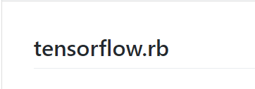
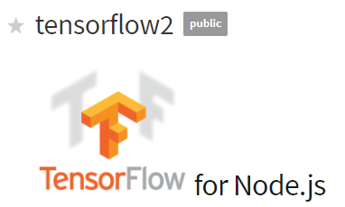

=====
Otros
=====

API de Ruby para utilizar TensorFlow.

TensorFlow Node. js JavaScript y una API de alto nivel para los usuarios de Node. js.

Proyectos para jugar:

	https://github.com/kevinhughes27/TensorKart

	.. image:: img/otro1.png 

	https://github.com/DanielSlater/PyGamePlayer

	.. image:: img/otro2.png 
